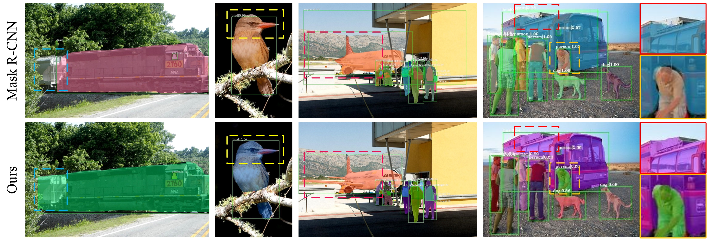
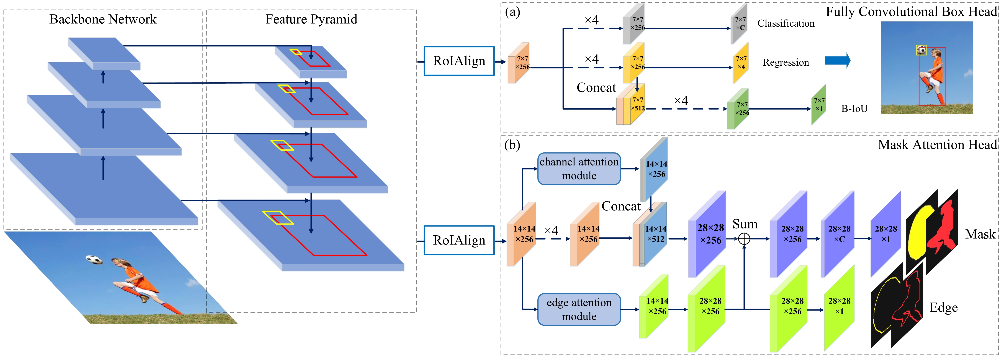

# Supervised Edge Attention Network forAccurate Image Instance Segmentation

Our work is based on the open-mmlab's [MMDetection](https://arxiv.org/abs/1906.07155), especially thanks to MMLab.

## Summary
Effectively keeping boundary of the mask complete is im-portant in instance segmentation. In this task, many works segmentinstance based on a bounding box from the box head, which means thequality of the detection also affects the completeness of the mask. Tocircumvent this issue, we propose a fully convolutional box head and asupervised edge attention module in mask head. The box head containsone new IoU prediction  branch. It learns association between objectfeatures and detected bounding boxes to provide more accurate boundingboxes for segmentation. The edge attention module utilizes attentionmechanism to highlight object and suppress background noise, and asupervised branch is devised to guide the network to focus on the edge ofinstances precisely. To evaluate the effectiveness, we conduct experimentson COCO dataset. Without bells and whistles, our approach achievesimpressive and robust improvement compared to baseline models.


## Highlights
- We  take  into  consideration  the  quality  of  the  bounding  box  in  instancesegmentation task. We apply fully convolutional box head and introduce a newbranch name “B-IoU” to learn the IoU scores between the detected boundingboxes and their corresponding ground-truth boxes for down-weighting thelow-quality detected bounding boxes with poor regression performance.
- As the boundaries of the instances are easily overwhelmed by the backgroundnoise  or  other  objects,  we  propose  supervised  edge  attention  module  tosuppress  the  noise  and  highlight  the  foreground.  Especially,  we  design  asupervised  branch  to  guide  the  network  to  learn  the  boundaries  of  theobjects.
- Without bells and whistles, our approach consistently improves the models ofMask R-CNN series, and is no limited to these models. Since the idea of ourwork is easily implemented and can improve both the accuracy of detectionand segmentation, it can be extended to other principles for instance-levelrecognition tasks.

## Installation
SEANet is implemennted on top of mmdetection. Threrfore the installation is the same as mmdetection.

Please refer to [INSTALL.md](docs/INSTALL.md) for installation and dataset preparation.


## Train and inference

SEANet configs could be found in [configs/SEANet](configs/SEANet)
- **Training**
```shell
# single-gpu training
python tools/train.py ${CONFIG_FILE}

# multi-gpu training
./tools/dist_train.sh ${CONFIG_FILE} ${GPU_NUM} [optional arguments]
```
- **Inference**
```shell
# single-gpu testing
python tools/test.py ${CONFIG_FILE} ${CHECKPOINT_FILE} --out ${RESULT_FILE} --eval bbox segm [--show]

# multi-gpu testing
./tools/dist_test.sh ${CONFIG_FILE} ${CHECKPOINT_FILE} ${GPU_NUM} --out ${RESULT_FILE} --eval bbox
```
## Results on COCO val2017

The baseline network used in the following table is Mask R-CNN.

|  Backbone  | SEANet  | APm | APm<sub>50</sub> | APm<sub>75</sub> | APb | APb<sub>50</sub> | APb<sub>75</sub> |
|:--------:|:--------:|:--------:|:--------:|:-----:|:-----:|:-----:|:-----:|
| ResNet-50-FPN| ✗        | 34.5        | 55.8        | 36.7     | 38.0     | 58.9     | 42.0      |
| ResNet-50-FPN| ✓        | 36.0        | 55.4        | 39.2     | 39.4     | 57.7     | 42.7      |
| ResNet-101-FPN| ✗        | 36.5        | 58.1        | 39.0     | 40.3     | 61.5     | 44.1      |
| ResNet-101-FPN| ✓        | 37.7        | 57.8        | 40.8     | 41.7     | 60.0     | 45.6      |
| ResNeXt-101-FPN| ✗        | 37.7        | 59.9        | 40.4     | 42.0     | 63.1     | 46.1      |
| ResNeXt-101-FPN| ✓        | 39.4        | 60.1        | 42.8     | 44.1     | 62.6     | 48.1      |
## Acknowledgement
This work was partially supported by the State Key Pro-gram of National Natural Science of China (No. 61836009), the National NaturalScience Foundation of China (Nos. U1701267, 61871310, 61773304, 61806154,61802295 and 61801351), the Fund for Foreign Scholars in University Researchand Teaching Programs (the 111 Project) (No. B07048), the Major ResearchPlan of the National Natural Science Foundation of China (Nos. 91438201 and91438103).
